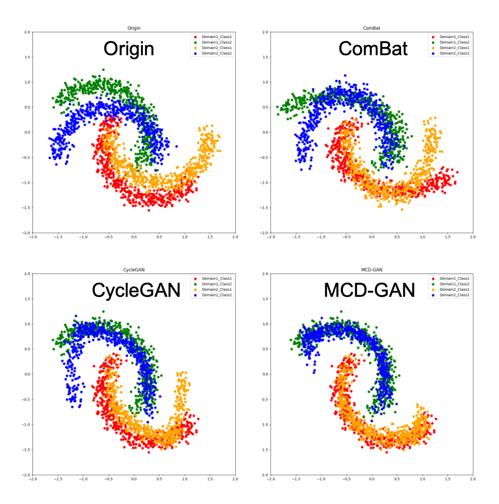

# Maximum Classifier Discrepancy Generative Adversarial Network (MCD-GAN)
## multi-scanner harmonizaton package (python 3.7)
Multi-site collaboration is essential for overcoming the small-sample problems in exploring reproducible biomarkers in MRI studies. However, various scanner-specific factors dramatically reduce the cross-site replicability. Existing harmonization methods mostly could not guarantee the improved performance of downstream tasks after harmonization. Therefore, we propose a new multi-scanner harmony framework, called “maximum classifier discrepancy generative adversarial network” (MCD-GAN), for removing scanner effects while improving performances in the subsequent tasks. The adversarial generative network is utilized for persisting the structural layout of the data, and the maximum classifier discrepancy theory can regulate feature generating procedure while considering the downstream classification tasks. 

For any question or comments please contact Weizheng Yan (conanywz@gmail.com), Vince Calhoun (vcalhoun@gsu.edu) or Cyrus Eierud (ceierud@gsu.edu)

Please also cite: "W. Yan, Z. Fu, J. Sui and V. D. Calhoun, "‘Harmless’ adversarial network harmonization approach for removing site effects and improving reproducibility in neuroimaging studies," 2022 44th Annual International Conference of the IEEE Engineering in Medicine & Biology Society (EMBC), 2022, pp. 1859-1862, doi: 10.1109/EMBC48229.2022.9871061."


## Run the code base
### Configure environments
Create virtual python environment
```sh
conda create -n harmony python=3.7
conda activate harmony
```
Install the required python packages.
```sh
pip install -r  requirements.txt
```

### Run and compare harmony methods 
Run ComBat: 
```sh
python main_demo.py  -harmony_mode=ComBat  -feature_name=Demo --harmony_retrain=1
```
Run CycleGAN:
```sh
python main_demo.py  -harmony_mode=CycleGAN  -feature_name=Demo --harmony_retrain=1
```
Run MCD-GAN:
```sh
python main_demo.py  -harmony_mode=MCDGAN  -feature_name=Demo  --harmony_retrain=1 --lambda_discrepancy_control=3.2
```
Visulizing results
```sh
python demo_visualize.py
```

